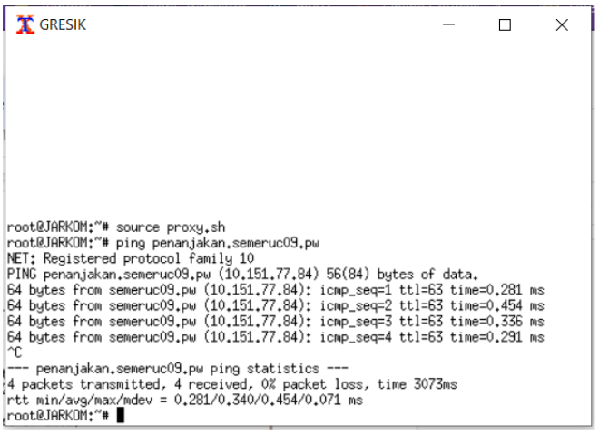

# Modul2_C09
Kelompok C09
- 05111840000028  M. Frediansyah Sinaga
- 05111840000072  Kresna Adhi Pramana

Praktikum Modul 2 berupa *UML, DNS (Domain Name System), dan Web Server*.


## Soal

Semeru adalah salah satu gunung yang terkenal di Jawa Timur. Bibah adalah salah satu juru kunci
Semeru. Bibah ingin menyebarkan keindahan Semeru pada dunia sehingga dia membeli 3 buah server
yang berada di MALANG , MOJOKERTO dan PROBOLINGGO . Server MALANG akan digunakan
sebagai DNS Server Master, MOJOKERTO akan digunakan sebagai DNS Server Slave dan
PROBOLINGGO akan digunakan sebagai Web Server. Selain 3 server terdapat 2 klien yang digunakan
untuk testing oleh Bibah yaitu GRESIK dan SIDOARJO . Untuk menyambungkan semua jaringan
tersebut Bibah memberi router di SURABAYA .

Kalian diminta untuk membuat sebuah website utama dengan (1) alamat http://semeruyyy.pw yang
memiliki (2) alias http://www.semeruyyy.pw , dan (3) subdomain
http://www.penanjakan.semeruyyy.pw yang diatur DNS-nya pada MALANG dan mengarah ke IP
Server PROBOLINGGO serta dibuatkan (4) reverse domain untuk domain utama. Untuk mengantisipasi
server dicuri/rusak, Bibah minta dibuatkan (5) DNS Server Slave pada MOJOKERTO agar Bibah tidak
terganggu menikmati keindahan Semeru pada Website. Selain website utama Bibah juga meminta
dibuatkan (6) subdomain dengan alamat http://gunung.semeruyyy.pw yang didelegasikan pada server
MOJOKERTO dan mengarah ke IP Server PROBOLINGGO . Bibah juga ingin memberi petunjuk
mendaki gunung semeru kepada anggota komunitas sehingga dia meminta dibuatkan (7) subdomain
dengan nama http://naik.gunung.semeruyyy.pw , domain ini diarahkan ke IP Server PROBOLINGGO.

Setelah selesai membuat keseluruhan domain, kamu diminta untuk segera mengatur web server. (8)
Domain http://semeruyyy.pw memiliki DocumentRoot pada /var/www/semeruyyy.pw . Awalnya web
dapat diakses menggunakan alamat http:// semeruyyy.pw /index.php/home . Karena dirasa alamat urlnya
kurang bagus, maka (9) diaktifkan mod rewrite agar urlnya menjadi http:// semeruyyy.pw /home .
(10) Web http://penanjakan.semeruyyy.pw akan digunakan untuk menyimpan assets file yang
memiliki DocumentRoot pada /var/www/ penanjakan.semeruyyy.pw dan memiliki struktur
folder sebagai berikut:
/var/www/ penanjakan.semeruyyy.pw
/public/javascripts
/public/css
/public/images
/errors

(11) Pada folder /public dibolehkan directory listing namun untuk folder yang berada di dalamnya
tidak dibolehkan. (12) Untuk mengatasi HTTP Error code 404, disediakan file 404.html pada
folder /errors untuk mengganti error default 404 dari Apache. (13) Untuk mengakses file assets
javascript awalnya harus menggunakan url http:// penanjakan.semeruyyy.pw /public/javascripts .
Karena terlalu panjang maka dibuatkan konfigurasi virtual host agar ketika mengakses file assets
menjadi http:// penanjakan.semeruyyy.pw /js .
Untuk web http:// gunung.semeruyyy.pw belum dapat dikonfigurasi pada web server karena
menunggu pengerjaan website selesai. (14) sedangkan web http:// naik.gunung.semeruyyy.pw
sudah bisa diakses hanya dengan menggunakan port 8888. DocumentRoot web berada pada
/var/www/ naik.gunung.semeruyyy.pw . Dikarenakan web http:// naik.gunung.semeruyyy.pw
bersifat private (15) Bibah meminta kamu membuat web http:// naik.gunung.semeruyyy.pw agar
diberi autentikasi password dengan username “ semeru ” dan password “ kuynaikgunung ” supaya
aman dan tidak sembarang orang bisa mengaksesnya.
Saat Bibah mengunjungi IP PROBOLINGGO , yang muncul bukan web utama
http:// semeruyyy.pw melainkan laman default Apache yang bertuliskan “It works!”. (16) Karena
dirasa kurang profesional, maka setiap Bibah mengunjungi IP PROBOLINGGO akan dialihkan
secara otomatis ke http:// semeruyyy.pw. (17) Karena pengunjung pada
/var/www/ penanjakan.semeruyyy.pw/public/images sangat banyak maka semua request gambar
yang memiliki substring “semeru” akan diarahkan menuju semeru.jpg.


## Jawaban
   1. Setting alamat utama : http://semeruc09.pw
      1. Install bind9 di MALANG
      2. Isikan configurasi http://semeruc09.pw di named.conf.local
      
      3. Buat folder jarkom di dalam /etc/bind
      4. Copykan file db.local pada path /etc/bind ke dalam folder jarkom yang baru saja dibuat dan ubah namanya menjadi semeruc09.pw
      5. Kemudian buka file semeruc09.pw dan edit seperti gambar berikut
      
      6. Restart bind9
      7. Test dengan mengubah nameserver di GRESIK dan ping semeruc09.pw
      
      
   2. Membuat alias http://www.semeruc09.pw
      1. Buka file semeruc09.pw pada server MALANG dan tambahkan konfigurasi seperti pada gambar berikut: 
      
      2. Restart bind9
      3. Untuk test, bisa ping www.semeruc09.pw di GRESIK
      
      
   3. Buat subdomain http://penanjakan.semeruc09.pw 
      1. Edit file /etc/bind/jarkom/semeruc09.pw lalu tambahkan subdomain untuk semeruc09.pw yang mengarah ke IP PROBOLINGGO. 
      
      2. Restart service bind
      3. Test ping penanjakan.semeru.c09.pw
      
      
   4. Reverse domain untuk domain utama
      1. Edit file /etc/bind/named.conf.local pada MALANG 
      2. Tambahkan konfigurasi berikut
      
      3. Copykan file db.local pada path /etc/bind ke dalam folder jarkom yang baru saja dibuat.
      4. Edit file 77.151.10.in-addr.arpa menjadi seperti gambar di bawah ini
      
      5. Kemudian restart bind9 
      6. Testing menggunakan host -t PTR 10.151.77.84 di GRESIK 
      
      
   5. Membuat DNS Server Slave pada MOJOKERTO
      1. Konfigurasi Pada Server MALANG
         1. Edit file /etc/bind/named.conf.local  
         
         2. Lakukan restart bind9
      2. Konfigurasi Pada Server MOJOKERTO
         1. Buka file /etc/bind/named.conf.local pada MOJOKERTO dan tambahkan syntax berikut:
         
         2. Lakukan restart bind9
      3. Testing
         1. Pada server MALANG matikan service bind9
         2. Pada client GRESIK pastikan pengaturan nameserver mengarah ke IP MALANG dan IP MOJOKERTO
         3. Lakukan ping ke semeruc09.pw pada client GRESIK.
         
        
   6. Buat subdomain dengan alamat http://gunung.semeruc09.pw yang didelegasikan pada server MOJOKERTO dan mengarah ke IP Server PROBOLINGGO. 
      1. Konfigurasi Pada Server MALANG
         1. Pada MALANG, edit file /etc/bind/jarkom/semeruc09.pw dan ubah menjadi seperti di bawah ini
         
         2. Kemudian edit file /etc/bind/named.conf.options pada MALANG.
         3. Kemudian comment dnssec-validation auto; dan tambahkan baris berikut pada /etc/bind/named.conf.options : `allow-query{any;};`
         
         4. Kemudian edit file /etc/bind/named.conf.local menjadi seperti gambar di bawah:
         
         5. Setelah itu restart bind9
      2. Konfigurasi Pada Server MOJOKERTO
         1. Pada MOJOKERTO edit file /etc/bind/named.conf.options
         2. Kemudian comment dnssec-validation auto; dan tambahkan baris berikut pada /etc/bind/named.conf.options `Allow-query{any;};` 
         
         3. Lalu edit file /etc/bind/named.conf.local
         
         4. Kemudian buat direktori dengan nama delegasi
         5. Copy db.local ke direktori pucang dan edit namanya menjadi gunung.semeruc09.pw
         6. Kemudian edit file gunung.semeruc09.pw
         
         7. Restart bind9
      3. Testing
         1. Lakukan ping ke domain gunung.semeruc09.pw dari GRESIK
         
         

   7. Buat subdomain dengan nama http://naik.gunung.semeruc09.pw, domain ini diarahkan ke IP Server PROBOLINGGO.
      1. Edit file gunung.semeruc09.pw di MOJOKERTO
      
      2. Kemudian Restart bind9
      3. Testing di GRESIK
      
     
      
   8. Domain http://semeruyyy.pw memiliki DocumentRoot pada /var/www/semeruyyy.pw.
      1. Install apache2 di PROBOLINGGO
      2. Install php
      3. Download file dengan wget di /var/www/
      4. Lalu setting di /etc/apache2/sites-available/semeruc09.pw.conf
      
      5. Jalankan a2ensite, lalu Reload dan restart apache2
      6. Testing :
      
      

   9. Aktifkan mod rewrite agar urlnya menjadi http://semeruyyy.pw/home. (Referensi jawaban :https://stackoverflow.com/questions/14149339/htaccess-short-url)
      1. Jalankan perintah a2enmod rewrite untuk mengaktifkan module rewrite. Lalu restart apache2.
      2. Buat file .htaccess di /var/www/semeruc09.pw dan diisi dengan :
      
      3. Edit file semeruc09.pw.conf
      
      4. Restart apache
      5. Testing, buka  http://semeruyyy.pw/home.
      
      

   10. Web http://penanjakan.semeruc09.pw akan digunakan untuk menyimpan assets file yang memiliki DocumentRoot pada /var/www/penanjakan.semeruc09.pw 
        dan memiliki struktur folder sebagai berikut:
       
       1. setting di /etc/apache2/sites-available/penanjakan.semeruc09.pw.conf
       
       2. Jalankan a2ensite, lalu Reload dan restart apache2
       

   11. Pada folder /public dibolehkan directory listing namun untuk folder yang berada di dalamnya tidak dibolehkan.
       1. Pindah ke directory /etc/apache2/sites-available kemudian buka file penanjakan.semeruc09.pw.conf , lalu tambahkan   
       
       2. Restart apache
       3. Testing
       
       
       
       

   12. Untuk mengatasi HTTP Error code 404, disediakan file 404.html pada folder /errors untuk mengganti error default 404 dari Apache.
       1. Menambahkan ErrorDocument 404 /errors/404.html di file penanjakan.semeruc09.pw.conf
       
       2. Testing
       
       
   13. Untuk mengakses file assets javascript awalnya harus menggunakan url http://penanjakan.semeruc09.pw/public/javascripts. Karena terlalu panjang maka dibuatkan konfigurasi
        virtual host agar ketika mengakses file assets menjadi http://penanjakan.semeruc09.pw/js.
       1. Edit file penanjakan.semeruc09.pw.conf ditambah Alias
       
       2. Testing
       
       
   14. Web http://naik.gunung.semeruc09.pw sudah bisa diakses hanya dengan menggunakan port 8888. DocumentRoot web berada pada /var/www/naik.gunung.semeruc09.pw.
       1. Download file naik.gunung.semeruc09.pw dengan wget
       2. Edit file naik.gunung.semeruc09.pw dengan VirtualHost = 8888 dan Documentroot nya sesuaikan 
       
       3. Tambahkan port 8888 pada file ports.conf
       
       4. Jalankan a2ensite lalu reload dan restart
       5. Testing
       

   15. Buat web http://naik.gunung.semeruyyy.pw agar diberi autentikasi password dengan username “semeru” dan password “kuynaikgunung” supaya aman dan tidak sembarang orang 
        bisa mengaksesnya. (referensi jawaban : https://www.digitalocean.com/community/tutorials/how-to-set-up-password-authentication-with-apache-on-ubuntu-14-04)
       1. Buat File passwordnya dengan command htpasswd -c /etc/apache2/.htpasswd semeru
       2. Lalu akan keluar password yang mau diisi, isi dengan kuynaikgunung, setelah itu password akan disimpan secara terenkripsi
       
       3. Lalu, pada file naik.gunung.semeruc09.pw.conf ditambahkan :
            ```
            <Directory "/var/www/html">
               AuthType Basic
               AuthName "Restricted Content"
               AuthUserFile /etc/apache2/.htpasswd
               Require valid-user
             </Directory>
             ```
       
       4. Restart apache
       5. Testing
       
       
       

   16.  Setiap mengunjungi IP PROBOLINGGO akan dialihkan secara otomatis ke http://semeruc09.pw. (referensi jawaban : https://www.digitalocean.com/community/questions/redirect-
         ip-address-to-domain-name-apache)
        1. Dengan cara, membuat direktori bernama alihkan di /var/www/ , lalu mengedit file 000-default yang DocumentRootnya diarahkan ke /var/www/alihkan dan edit agar dapat 
          membaca .htaccess
        
        2. Lalu, buat file .htaccess di dalam folder alihkan, yg berisi :
        
        3. Restart apache
        4. Testing
           1. Sebelum 
           
           2. Sesudah
           

   17. Karena pengunjung pada /var/www/penanjakan.semeruc09.pw/public/images sangat banyak maka semua request gambar yang memiliki substring “semeru” akan diarahkan menuju 
        semeru.jpg.(referensi jawaban : https://www.mynotepaper.com/how-to-redirect-url-using-htaccess-if-contains-specific-word)
       1. Edit file /etc/apache2/sites-available/penanjakan.semeruc09.pw.conf untuk bisa membaca .htaccess
       
       2. Tambahkan file .htaccess ke DocumentRoot penanjakan.semeruc09.pw 
       
       3. Testing, jika mengetik bukansemeruaja.jpg, tetap akan teralihkan ke semeru.jpg
       
       
       
